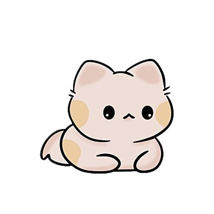

# CatClicker
 <br>
CatClicker is a cookie clicker-like game, but it's cats and coded in TypeSrcipt / HTML / CSS <br>
Last "playable" update can be played at https://catclicker.glddrk.fr <br>
Thanks for playing and enjoy!

## Usage
### Build and start locally
``` npm run build ``` <br>
``` npm run start ```
### Build and run on server
``` npm run build ``` <br>
``` cp index.html /path/to/the/server ``` <br>
``` cp src/* /path/to/the/server ```

## Changelog:

### 0.0.5 (1 MAR 25)
#### Major changes:
- Changing color scheme

#### Minor changes:
- Created a changelog file
